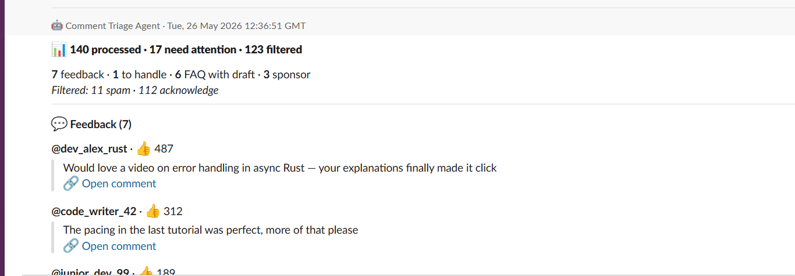
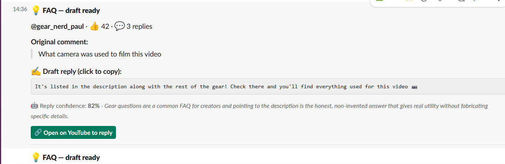
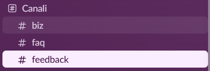
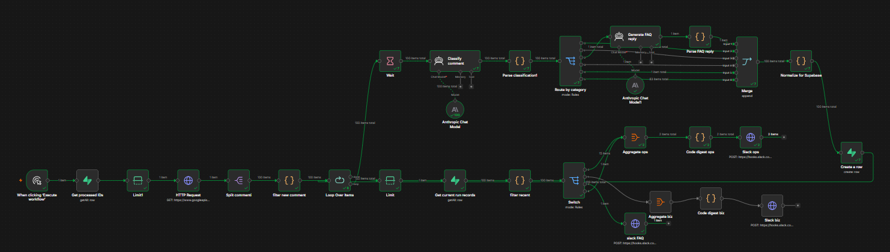
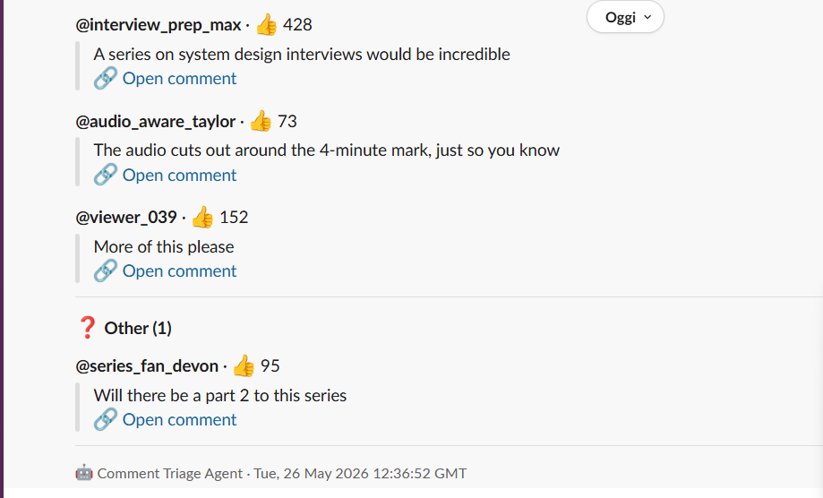
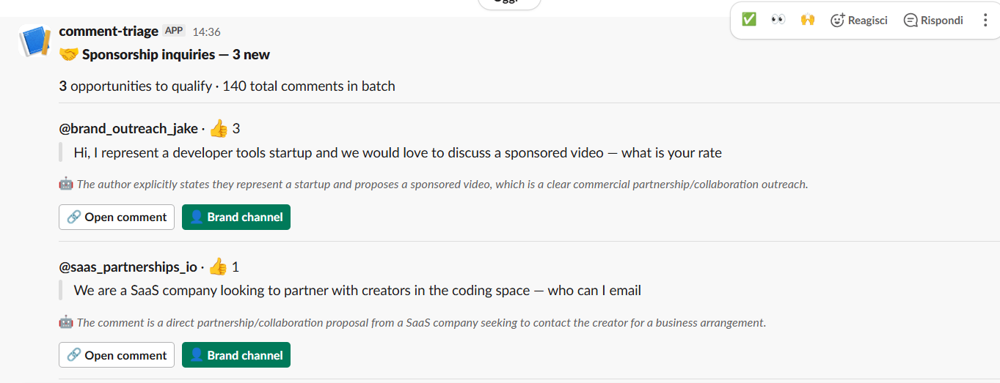

# Comment Triage Agent

An n8n workflow that turns hundreds of YouTube comments into a clean
Slack digest of what actually needs the creator's attention — with
FAQ replies pre-drafted, never auto-sent.

**Demo run: 140 comments in → 17 needing attention out, 123 filtered.**



<!-- LOOM_PLACEHOLDER: when the walkthrough video is recorded, embed
it here, above "The problem". A Loom of the system running beats any
written description. -->

## The problem

Creators with 1,000+ comments per day spend hours scrolling through
noise — repeated "first" comments, generic praise, spam — to find
the small percentage that requires action: a critical question, a
sponsorship inquiry, an error report on the video.

The signal-to-noise problem doesn't scale. Once a channel is big
enough to need to listen, it's also big enough that nobody has time
to.

## What it does

For each comment retrieved from the YouTube Data API, the workflow:

1. Deduplicates against past runs via a Supabase lookup
2. Classifies into one of 6 categories with Claude (Sonnet 4.6, temperature 0)
3. Routes through a Switch node
4. Aggregates results into a single per-channel Slack digest

The 6 categories:

| Category | What it is | What happens |
|---|---|---|
| `spam` | Bots, link spam, scams, offensive content | Logged only |
| `acknowledge` | Generic praise, jokes, hype, low-content reactions | Logged only — filtered out of Slack |
| `feedback` | Actionable comments: error reports, format suggestions, content requests | Aggregated into the `#feedback` digest |
| `FAQ` | Common questions with standard answers | Claude generates a draft reply with a confidence score — **never auto-sent**, always reviewed by the creator |
| `sponsor` | Brand outreach, partnership inquiries | Aggregated into the `#biz` digest |
| `other` | Ambiguous, non-EN/IT, or specific questions needing human review | Aggregated into the `#feedback` digest |

On the demo run: 140 comments compressed into 17 items needing
attention (7 feedback, 1 other, 6 FAQ with drafts ready, 3 sponsor),
with 123 filtered out (11 spam, 112 acknowledge).

## Why human-in-the-loop, always

A core design choice: the FAQ branch generates a **draft reply with
reasoning and a confidence score**, posted to Slack for the creator
to send, edit, or ignore. **The workflow never auto-replies on
YouTube.**

This is intentional. Auto-reply bots erode trust with an audience —
viewers can tell. The win isn't replacing the creator's voice; it's
removing the 80% of work that is finding which comments deserve a
voice at all, and pre-writing the obvious answers so the creator
just has to send.



## How it works

The workflow runs across three Slack channels (`#feedback`, `#biz`,
`#faq`) and a Supabase table for state:



Full n8n graph:



Pipeline (read `workflow.json` for the full node graph):

```

Manual Trigger
  → Get processed IDs (Supabase, disabled by default in the demo)
  → Limit (collapse N to 1 item before the HTTP call)
  → HTTP Request (YouTube Data API v3, commentThreads endpoint)
  → Split commenti (Split Out on the items array)
  → filter new comment (Code: dedup via Set lookup, preserves pairedItem)
  → Loop Over Items (batch 15, with a 40s Wait per batch for the Anthropic rate limit)
      ├─ loop → Wait → Classify comment (AI Agent + Anthropic Chat Model)
      │             → Parse classification (flatten + normalize schema)
      │             → Route by category (Switch, 6 branches)
      │                  ├─ feedback / sponsor / other / spam / acknowledge → Merge
      │                  └─ FAQ → Generate FAQ reply (second AI Agent)
      │                         → Parse FAQ reply (Code)
      │                         → Merge
      │             → Create a row (Supabase insert)
      │             → ↻ loop back to Loop Over Items
      └─ done → Limit → Get current run records (Supabase)
                     → filter recent (Code: filter by classified_at)
                     → Switch (external, 4 branches)
                          ├─ feedback / other → Aggregate → Code digest ops → Slack #feedback
                          ├─ sponsor → Aggregate → Code digest biz → Slack #biz
                          └─ FAQ → Slack #faq (one message per FAQ)

```

### Sample outputs

The feedback digest, after triage:



Sponsor inquiries, with AI reasoning under each entry:



### Design decisions

- **Dedup before Claude, not after.** Filtering against `comment_id`
  already present in Supabase before classifying saves Anthropic
  tokens on scheduled re-runs. On the second run of the same video,
  ~95% of comments are skipped.
- **Schema normalization upstream.** `Parse classification` outputs
  `reply_*: null` for non-FAQ rows so the Supabase batch insert
  (which goes through PostgREST) gets uniform keys across all
  categories. PostgREST rejects batches with mismatched keys.
- **Aggregates outside the loop, individual messages inside.**
  Digests for feedback / other / sponsor are aggregated post-loop
  and sent once per channel. FAQ draft replies are sent one-per-FAQ
  because the per-comment context (the draft itself) is the value.
- **Defensive parsers.** All `Code` nodes wrap `JSON.parse` in
  `try/catch` with a clear error containing the malformed output —
  Claude going off-script doesn't crash the workflow silently.

## Stack

- [n8n](https://n8n.io) (self-hosted)
- [Anthropic Claude](https://www.anthropic.com) — Sonnet 4.6 for classification and FAQ draft generation
- [YouTube Data API v3](https://developers.google.com/youtube/v3) — `commentThreads` endpoint, read-only
- [Slack incoming webhooks](https://api.slack.com/messaging/webhooks) — 3 channels (`#feedback`, `#biz`, `#faq`)
- [Supabase](https://supabase.com) — Postgres + PostgREST, free tier is sufficient

Approximate cost on a channel with ~1,000 new comments/day: $3–8/month in Anthropic API tokens, every other service in free tier.

## Demo vs production

This repo ships the **demo version**: read-only on YouTube (API key, not OAuth), manual trigger, single video ID hardcoded in the HTTP node.

In production:

- **OAuth YouTube credentials** to publish FAQ reply drafts directly from the workflow, instead of the creator copy-pasting from Slack
- **Scheduled trigger** (every 30 minutes) instead of manual
- **`Get processed IDs` enabled** for truly idempotent runs
- **Per-channel customization** — niche, tone, knowledge base injected via workflow Variables instead of hardcoded in the system prompts
- **Pagination beyond 100 comments** — a `nextPageToken` loop in the HTTP node for channels with high comment velocity
- **Retry logic on API failures** — Anthropic rate limits and YouTube quota hits handled with exponential backoff

## Known limitations

- **Text classification is not 100% accurate.** Low-signal irony without explicit markers (a deadpan joke without an emoji) can be misclassified. The `acknowledge` default is intentional: false negatives on feedback hurt the UX less than false positives that flood Slack with noise.
- **The `other` branch exists for ambiguous cases.** Non-EN/IT comments, comments requiring deep context the LLM doesn't have, and specific non-FAQ questions all fall into `other` for human review.
- **No language fine-tuning per channel.** A creator working in Italian + English is handled out of the box; Spanish or French requires extending the system prompt.
- **No engagement context.** The workflow classifies one comment at a time. It doesn't yet weight signals based on the creator's reply history or community patterns.

## Production considerations

If you're forking this to deploy on your own infrastructure:

- Anthropic Tier 1 limits you to 30K input tokens/min. The classification system prompt is ~2K tokens; with the current batch size (15) and Wait (40s), the workflow stays well under that limit. For higher volume, either upgrade to Tier 2 ($5 minimum spend) or enable Anthropic prompt caching.
- Supabase free tier (500MB) holds roughly 5M rows in `comment_classifications`. For high-volume channels, add a cleanup job that drops rows older than 30 days.
- Slack webhook URLs are channel-scoped — keep them in workflow Variables (Settings → Variables), not in the exported `workflow.json` body.
- Schedule the workflow at an interval longer than its execution time (typically 5–10 minutes for a 1,000-comment batch with the rate-limit-respecting Wait).

This is a reference build tuned for channels up to ~100 comments per run. Higher-volume setups (viral videos, 1M+ sub channels) need additional engineering — happy to scope that on a call (link below).

## Setup

See [docs/setup.md](docs/setup.md) — 30–45 minutes end to end if you've never used n8n or Supabase, 10–15 if you have.

## Need this built for your channel?

I build AI workflows like this one for YouTube creators and content
businesses — channel ops automation, ship in 5–14 days, code lives
on your GitHub.

- 🌐 [mirkofratangelo.com](https://mirkofratangelo.com)
- 📅 [Book a discovery call](https://cal.com/mirko-fratangelo/discovery)
- 💼 [LinkedIn](https://www.linkedin.com/in/YOUR_LINKEDIN_HANDLE)
- 🛠️ [Contra profile](https://contra.com/mirkofratangelo)

## License

MIT — fork, modify, ship.

---

Built by [Mirko Fratangelo](https://github.com/Mirkofratangelo). For YouTube creators who'd rather make videos than triage comments.
